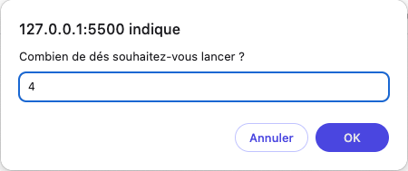
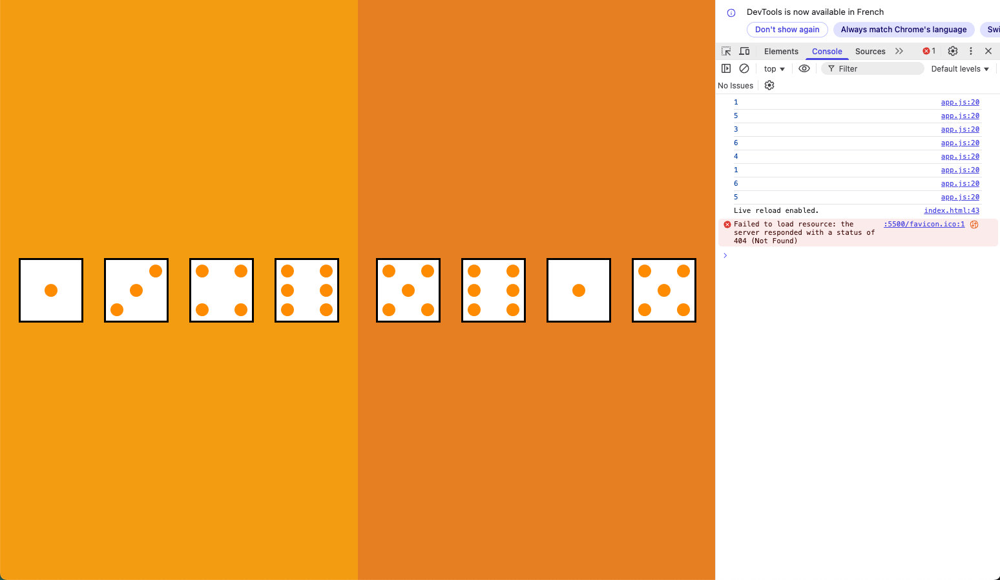

---
date:
  created: 2025-10-13
---

# **📅 AISON A Semaine 5 Épisode 1 - Le DOM**

## **📚 Notions du jour**

+ DOM (Document Object Model),
+ Expliquer le principe du DOM,
+ Accéder à un élément de la page en JS (getElement(s)By, querySelector…),
+ Modifier un élément de la page (objet HTMLElement),
+ Créer un élément,
+ Insérer un élément dans un autre,
+ Utiliser la documentation pour connaitre les actions possibles avec un élément.

<!-- more -->

---

### **🌐 Le DOM : Le Lien Magique entre HTML et JavaScript**

Aujourd’hui, j’ai plongé dans l’un des concepts les plus fondamentaux du développement web : **le [DOM](https://developer.mozilla.org/en-US/docs/Web/API/Document_Object_Model)**, ou *Document Object Model*. En gros, le DOM est une **représentation en mémoire** de la structure de votre page HTML, sous forme d’un arbre d’objets. Chaque balise HTML (un `<div>`, un `<p>`, etc.) devient un **nœud** dans cet arbre, et JavaScript peut interagir avec ces nœuds pour **modifier dynamiquement** la page.

**Pourquoi c’est puissant ?**
Sans le DOM, JavaScript ne pourrait pas réagir aux actions de l’utilisateur (clics, saisies…) ni mettre à jour le contenu sans recharger la page. C’est la base des **applications web dynamiques** !

---

### **🔍 Accéder aux Éléments : Les Sélecteurs, ces Clés d’Accès**

Pour manipuler un élément, il faut d’abord le **cibler**. JavaScript offre plusieurs méthodes :

+ **`getElementById()`** : Récupère un élément par son ID (unique).

  ```javascript
  const myTitle = document.getElementById("my-title");
  ```

+ **`getElementsByClassName()`** : Récupère une liste d’éléments par leur classe.
+ **`querySelector()`** : Utilise des sélecteurs CSS pour cibler un élément (le premier trouvé).

  ```javascript
  const firstLink = document.querySelector("a");
  ```

+ **`querySelectorAll()`** : Comme `querySelector`, mais retourne **tous** les éléments correspondants.

💡 *Astuce* : `querySelector` est ultra-flexible et permet des sélections complexes, comme `div > p.highlight`.

---

### **✨ Modifier un Élément : L’Objet HTMLElement**

Une fois l’élément ciblé, on peut **lire ou modifier** ses propriétés et son contenu :

+ **Contenu texte** : `element.textContent` ou `element.innerHTML` (attention, ce dernier interprète le HTML. Il peut insérer des balises `<script>` et ainsi laisser la porte ouverte pour une attaque XSS. Préférer l'utilisation de `element.innerText`).
+ **Attributs** : `element.setAttribute("class", "class-name")`, `element.classList("class-name")`, `element.id = "id-name"`.
+ **Styles** : `element.style.color = "red"`.

Exemple :

```javascript
const button = document.querySelector("button");
bouton.textContent = "Click Me!";
bouton.style.backgroundColor = "#4CAF50";
```

---

### **🛠️ Créer et Insérer des Éléments : Construire la Page Dynamiquement**

JavaScript permet de **créer** des éléments et de les ajouter à la page :

1. **Créer** un élément :

   ```javascript
   const newParagraph = document.createElement("p");
   newParagraph.textContent = "Hello, world!";
   ```

2. **L’insérer** dans le DOM :

   + `parent.appendChild(newParagraph)` : Ajoute l'élément en tant qu'enfant de l'élément parent ciblé.
   + `parent.insertBefore(newParagraph, elementReference)` : Insère un nœud avant un *nœud de référence* en tant qu'enfant d'un *nœud parent spécifié*.

💡 *Cas pratique* : Ajouter une liste d’items générée dynamiquement à partir d’un tableau JavaScript.

---

### **📚 La Documentation : Le Guide Ultime**

Le DOM est vaste, et personne ne retient tout ! La **[documentation MDN](https://developer.mozilla.org/fr/docs/Web/API/Document_Object_Model)** est une mine d’or :

+ Elle liste **toutes les propriétés et méthodes** disponibles pour chaque type d’élément.
+ Exemples concrets et compatibilité navigateur.

💡 *Conseil* : Apprendre à chercher efficacement dans la doc. Par exemple, taper "MDN HTMLElement" pour explorer les méthodes d’un élément.

---

### **🎯 Ce Que Je Retiens**

+ Le DOM est une **interface** entre HTML et JavaScript.
+ Les sélecteurs (`querySelector`, `getElementById`) sont essentiels pour cibler des éléments.
+ On peut **lire, modifier, créer, et supprimer** des éléments dynamiquement.
+ La documentation est **indispensable** pour découvrir les possibilités.

**Prochaine étape** : Explorer les événements (`addEventListener`) pour rendre mes pages interactives !

---

## **⌨️ Challenge du jour**

### **🎲 Dice roller**

#### **🎯 But du Challenge**

Créer une application web interactive permettant de **simuler le lancer de dés 🎲🎲** en JavaScript. L’objectif est de générer visuellement un ou plusieurs dés, dont la face est déterminée aléatoirement, et d’afficher ces dés dans l’interface utilisateur. En bonus, le challenge propose d’ajouter un adversaire (un deuxième joueur virtuel) pour comparer les lancers.

---

#### **🔗 Lien avec les Notions du Jour**

Ce challenge met en pratique **toutes les notions clés du DOM** apprises aujourd’hui :

+ **Création d’éléments HTML** (`div`) via JavaScript.
+ **Manipulation des classes et styles** pour appliquer des styles CSS existants et afficher un sprite (image composite).
+ **Insertion d’éléments dans le DOM** pour afficher les dés dans des zones spécifiques de la page.
+ **Modification dynamique des propriétés CSS** (comme la position de l’arrière-plan) pour changer la face du dé.
+ **Interaction avec l’utilisateur** via `prompt` pour personnaliser le nombre de dés lancés.
+ **Utilisation de la documentation** pour comprendre comment manipuler les éléments et leurs propriétés (comme `background-position`).

---

#### **📋 Étapes à Réaliser**

1. **Création d’un Dé en JavaScript**
2. **Génération d’un Nombre Aléatoire et Affichage de la Face du Dé**
3. **Lancer Plusieurs Dés**
4. **Bonus : Ajouter un Adversaire**

---

#### **💻 Langage de Programmation Utilisé**

Le challenge est entièrement réalisé en **JavaScript**, avec une interaction directe avec le **DOM** pour manipuler les éléments HTML et CSS. Le HTML et CSS sont fournis (ou peuvent être générés dynamiquement en JavaScript pour s’entraîner), mais la logique principale repose sur JavaScript. L'image *stripe* (contenant toutes les faces d'un dé, chaque face faisant `100px` de largeur) à manipuler pour afficher les dés est également fournie.

---

#### **🧑‍💻 Ma proposition de code pour ce challenge**

``` {.html .select title="index.html" linenums="1"}
<!DOCTYPE html>
<html lang="fr">
<head>
    <meta charset="UTF-8">
    <link rel="stylesheet" href="../css/reset.css">
    <link rel="stylesheet" href="../css/styles.css">
    <title>Roll</title>
</head>
<body>
    <div id="app">
        <div class="board" id="player"></div>
    </div>
    <script src="../js/app.js"></script>
</body>
</html>
```

``` {.js .select title="app.js" linenums="1"}

// Get the main board element from the DOM by its id 'app'
const boardElt = document.getElementById("app");
// Create a new div element to represent the dealer's board and add an id and class to it
const dealerElt = document.createElement("div");
dealerElt.classList.add("board");
dealerElt.id = "dealer";
// Append the dealer's board to the main board
boardElt.appendChild(dealerElt);

/**
 * Generates a dice for the specified player and appends it to the player's board.
 * The dice face is determined randomly between 1 and 6.
 * @param {string} player - The id of the player ('player' or 'dealer') to whom the dice will be added.
 */
function generateDice(player) {
  // Generate a random number between 1 and 6 to represent the dice value
  const diceValue = (Math.floor(Math.random() * 6) + 1);
  // Log the dice value to the console for debugging and check if the diceValue corresponds to the correct dice face displayed
  console.log(diceValue);
  // Create a new div element to represent the dice
  const diceElt = document.createElement("div");
  diceElt.classList.add("dice");
  // Get the player's board element by its id
  const playerElt = document.getElementById(player);
  // Append the dice element to the player's board
  playerElt.appendChild(diceElt);

  // Set the background position based on X axis to display the correct dice face using a sprite
  diceElt.style.backgroundPositionX = `${(-100 * diceValue) + 100}px`;
}

// Ask the user how many dice they want to roll and convert the input to a number
const playerInput = Number(prompt("Combien de dés souhaitez-vous lancer ?"));

// Loop to generate the specified number of dice for both the player and the dealer
for (let dice = 1; dice <= playerInput; dice++) {
  generateDice("player");
  generateDice("dealer");
}
```

??? success "**Résultat attendu.**"

    
    
