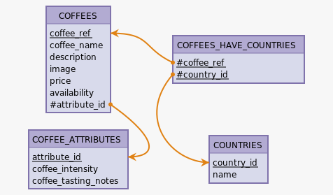

---
date:
  created: 2025-11-26

---

# **📅 SAISON B Semaine 4 Épisode 3 - Projet en autonomie - oCoffee**

## **📚 Introduction**

Aujourd’hui je démarre la réalisation complète d'un projet en autonomie. Le but étant de mettre en pratique tout ce que j'ai vu jusqu'à présent dans ma formation et d'apprendre à me débrouiller par moi-même. Nous avons 3 jours pour la réalisation de ce projet.

Je dois créer le site web **oCoffee**, un site vitrine fictif pour une boutique de café haut de gamme.

Aujourd’hui, je me suis concentré sur **l’organisation du projet**, **la modélisation des données** et **l’initialisation de l’application Express**. Plongeons dans les détails !

!!! Note Dépôt Github
    Le dépôt Github du projet est disponible [ici](https://github.com/YoannMis/oCoffee).

<!-- more -->

## **Étape 1 : Découpage du projet avec le Kanban de GitHub**

Avant de me lancer dans le code, j’avais besoin d’un plan clair. J'ai commencé par m'imprénier du cahier des charges fournis avec la demande du client *fictif*. J'ai noté les points essentiels et à partir de là j'ai réfléchi à comment découper mon projet.

Pour cela j’ai utilisé le **tableau Kanban de GitHub** pour diviser le projet en petites tâches gérables. Voici comment j’ai structuré mon tableau :

+ **À faire** : Les tâches que je dois aborder.
+ **En cours** : Les tâches sur lesquelles je travaille actuellement.
+ **Terminé** : Les tâches accomplies.

**Exemple de mon tableau Kanban pour le Jour 1 :**

| **À faire**                     | **En cours**               | **Terminé**                      |
|---------------------------------|----------------------------|----------------------------------|
| Initialiser le projet Express   | Transformer le MCD en MLD  | Configuration du projet GitHub   |
| Configurer EJS et PostgreSQL    |                            | Installation de Node.js          |
|                                 |                            | Créer le MCD (Modèle Conceptuel) |
|                                 |                            |                                  |

Cette approche m’a aidé à visualiser ma progression et à rester concentré.

---

## **Étape 2 : Création du MCD – Mon premier défi**

La première tâche majeure était de créer le **Modèle Conceptuel de Données (MCD)**. J’ai dû identifier les entités, leurs attributs et leurs relations.

### **Difficultés rencontrées**

**Apprentissage de l’outil** : J’ai décidé d’utiliser **[Mocodo](https://www.mocodo.net/)** (un outil de modélisation de données) pour la première fois. Cela m’a pris un certain temps pour comprendre comment l’utiliser efficacement.

### **Solution**

J’ai passé du temps à lire la documentation de Mocodo et à regarder des tutoriels. Après quelques tentatives, j’ai réussi à créer un MCD cohérent.

**Voici le MCD que j’ai conçu :**


---

## **Étape 3 : Transformation du MCD en MLD**

Une fois le MCD prêt, je l’ai transformé en **Modèle Logique de Données (MLD)**. Cette étape consistait à définir les tables, les clés primaires, les clés étrangères et les types de données.

**Rerésentation du MLD :**



---

## **Étape 4 : Initialisation du projet Express**

Après avoir finalisé les modèles de données, je me suis attaqué à la **configuration du projet Express**. Cela a impliqué :

1. **Créer le répertoire du projet** et l’initialiser avec `npm init`.
2. **Installer les dépendances** : `express`, `ejs`, `pg` et `dotenv`.
3. **Configurer le serveur Express de base** et définir EJS comme moteur de rendu.

### **Configuration du projet**

```bash
# Initialiser le projet
mkdir ocoffee
cd ocoffee
npm init -y

# Installer les dépendances nécessaires
npm install express ejs pg dotenv
```

### **Serveur Express de base (`index.js`)**

```javascript title="index.js"
/**
 * Main entry point for the Ocoffee application.
 * Sets up the Express server, view engine, static files, and routing.
 */
import express from "express";
import 'dotenv/config';

// Get the port from environment variables
const PORT = process.env.PORT;

// Create an instance of express server
const app = express();

/**
 * Tests server by sending "Hello World" to route "/"
 */
app.get('/', (req, res) => {
  res.send('Hello World!');
});

/**
 * Start the server and listen on the specified port.
 * Logs a message when the server is running.
 */
app.listen(PORT, () => {
  console.log("Server is running on http://localhost:3000");
});
```

---

## **Bilan de la journée**

Aujourd’hui a été une **journée productive** ! J’ai réussi à :

+ Organiser mes tâches avec le Kanban de GitHub.
+ Créer le MCD et le MLD pour le projet.
+ Configurer le projet avec un serveur Express.

**Objectifs pour demain :**

+ Implémenter pleinement l’architecture MVC.
+ Créer les premières vues dynamiques pour le catalogue de cafés.
