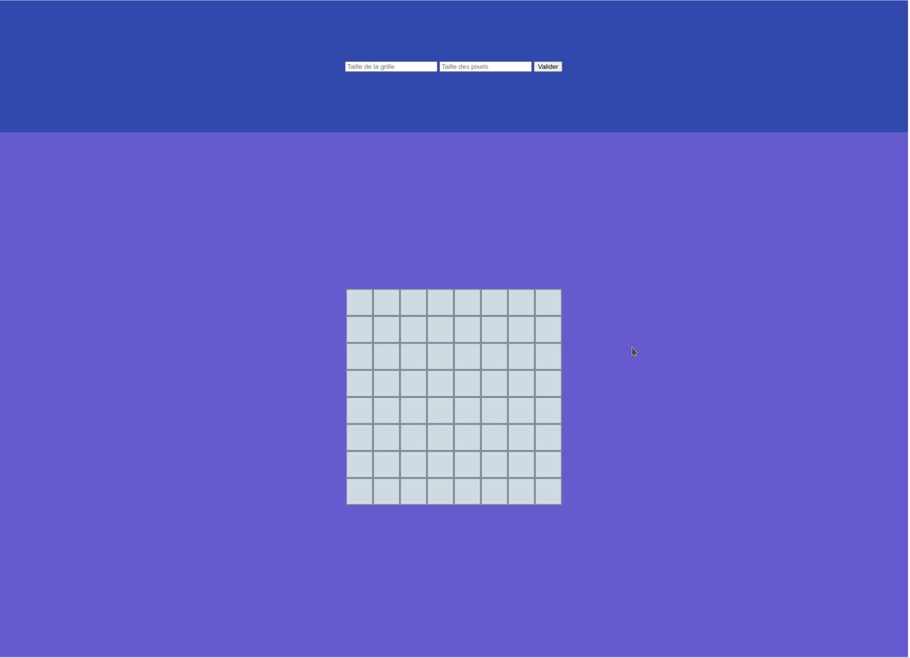
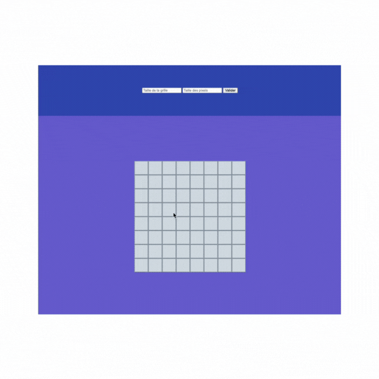
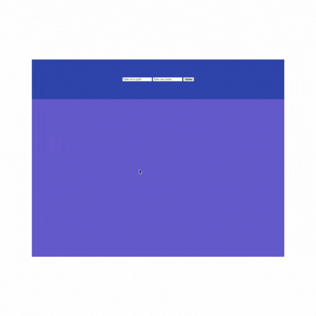
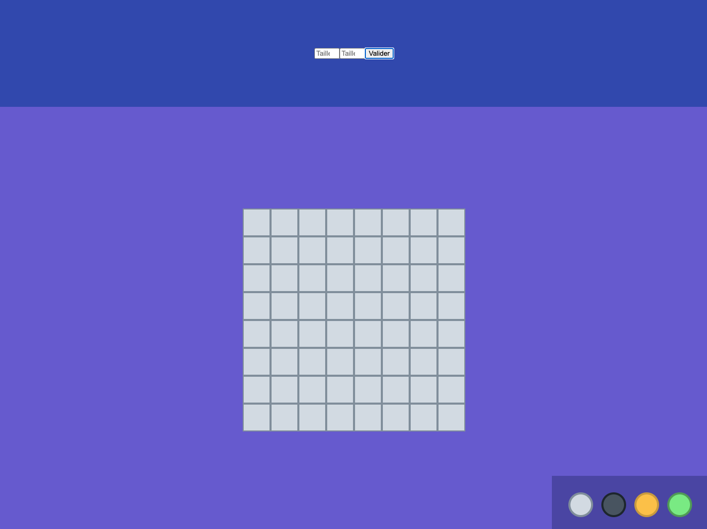
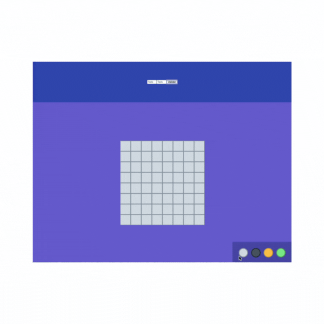
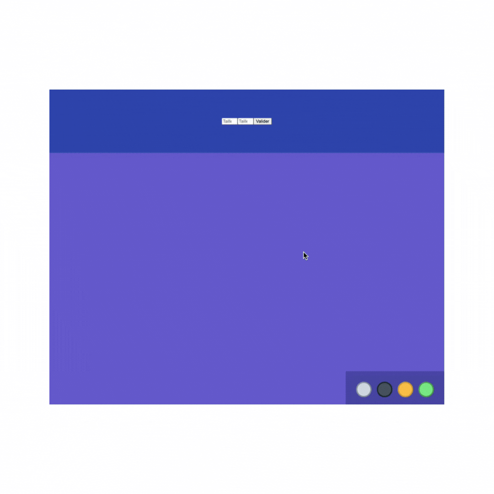

---
date:
  created: 2025-10-15
  updated: 2025-10-16
---

# **📅 SAISON A Semaine 5 Épisode 3 - Une Journée en Pair-Programming**

## **📚 Notions du jour**

Aujourd’hui, j’ai participé à un **atelier en pair-programming** avec pour objectif de créer une **application web d’ardoise pixel art**, inspirée du style rétro de *Space Invaders*. Le défi ? **Tout générer en JavaScript** : la grille de pixels, le formulaire de configuration, et même la palette de couleurs. Nous avions seulement une maquette comme point de départ. Pas de code fourni, juste une idée à concrétiser !

<!-- more -->

---

!!! note "🖊️ Mise à jour le 16 octobre 2025"

    Cet article a été mis à jour pour inclure une amélioration du code permettant de corriger les problèmes rencontrés énoncés dans la section 🎨 Améliorations et Défis.  
    Ajout de la section suivante : 💪 Suite et fin !

### **📐 Étape Préparatoire : Découper la Maquette**

Le matin, nous avons commencé par **analyser la maquette** pour identifier les éléments clés :

1. **Un `<header>`** contenant un formulaire avec :
   + Un *input* pour définir la **taille de la grille** (en nombre de pixels).
   + Un *input* pour définir la **taille des pixels** (en pixels).
   + Un bouton pour valider et générer la grille.
2. **Un `<main>`** contenant :
   + La **grille de pixels** (notre ardoise).
   + Une **palette de couleurs** en bas, pour choisir la couleur des pixels.

**Action :** Nous avons créé une structure HTML basique et ajouté un peu de CSS pour styliser les éléments (couleurs, tailles, etc.). L’idée était de préparer le terrain pour que JavaScript puisse prendre le relais. Nous sommes partis d'une grille de départ composée de 8 x 8 pixels (chaque pixel faisant une taille de `50px`) *codée en dur* dans le HTML pour prévisualiser le rendu attendu.

```html title="invader.html - Body content"
<!DOCTYPE html>
<html lang="en">
<body>
  <header>
    <form action="">
      <input type="number" min="" max="" step="1" placeholder="Taille de la grille">
      <input type="number" min="" max="" step="1" placeholder="Taille des pixels">
      <button type="submit">Valider</button>
    </form>
  </header>

  <main>
    <div id="grid">
      <!-- Simulate a 8x8 grid -->
      <div class="pixel"></div>
      <!-- <div class="pixel"></div> 
           <div class="pixel"></div>
           <div class="pixel"></div>
           ...
           <div class="pixel"></div>-->
      <div class="pixel"></div>
    </div>
    <div class="palette"></div>
  </main>
  <script src="../js/app.js"></script>
</body>
</html>
```

```css title="style.css - base CSS"
:root {
    --pixel-color-grey-light: #D2DAE2;
    --pixel-border-grey-light: #808E9B;
    --pixel-color-grey-dark: #485460;
    --pixel-border-grey-dark: #1D262D;
    --bg-color-main: #665ACE;
    --bg-color-header: #3148AD;
}

header {
    background-color: var(--bg-color-header);
    height: 20dvh;
    display: flex;
    justify-content: center;
    align-items: center;
}

main {
    background-color: var(--bg-color-main);
    height: 80dvh;
    display: flex;
    justify-content: center;
    align-items: center;
}

#grid {
    display: grid;
    grid-template-rows: auto;
    width: auto;
    height: auto;
}

.pixel {
    background-color: var(--pixel-color-grey-light);
    border: 2px solid var(--pixel-border-grey-light);
    height: 50px;
    width: 50px;
}
```

---

### **💻 Création de l’Application avec JavaScript**

#### **1️⃣ Générer la Grille de Pixels**

**Objectif :** Générer une grille dynamique en fonction de la taille choisie par l’utilisateur.

**Première approche :** Avant de nous attaquer à la gestion du formulaire, nous avons commencé avec un `#!javascript prompt()` pour demander la taille de la grille, en fixant la taille des pixels à `50px` pour les tests.

```javascript title="app.js - Grid generation" linenums="1"
// Get #grid Element
const grid = document.getElementById("grid");
// Initial test with a prompt
const userInput = Number(prompt("Taille de la grille ?"));

// Use the grid-template-columns CSS property to create the grid
grid.style.gridTemplateColumns = `repeat(${userInput}, 1fr)`;
// Generate the grid
for (let round = 0; round < userInput * userInput; round++) {
  const pixel = document.createElement("div"); // Create a pixel element
  pixel.classList.add("pixel"); // Add .pixel class to the pixel element
  grid.appendChild(pixel); // Append pixel element into #grid element
}
```

??? success "**Résultat :** Une grille de pixels gris clair, prête à être colorée !"

    

---

#### **2️⃣ Rendre les Pixels Cliquables**

**Objectif :** Changer la couleur d’un pixel au clic (noir par défaut).

**Solution :** Nous avons pensé à créer une classe `dark` afin de l'ajouter à un pixel lorsque celui-ci est *cliqué*. Si un pixel possède la classe `dark`, alors il prend la couleur *noir*. En cherchant dans la documentation, nous avons trouver que nous pouvions utiliser un `addEventListener` avec la méthode `toggle()` de l'objet `classList`d'un *HTML DOM element* pour basculer entre les classes CSS.

```javascript title="app.js - Toggling pixel color" linenums="6"
// ...

// Generate the grid with toggle event on pixels
for (let round = 0; round < userInput * userInput; round++) {
  const pixel = document.createElement("div"); // Create a pixel element
  pixel.classList.add("pixel"); // Add .pixel class to the pixel element
  // Add "click" event Listener with classList.toggle() method on pixels
  pixel.addEventListener("click", () => {
    pixel.classList.toggle("dark");
  });
  grid.appendChild(pixel); // Append pixel element into #grid element
}
```

**CSS associé :**

```css title="style.css - Add .dark class"
.dark {
    background-color: var(--pixel-color-grey-dark); /* Corresponding to #485460 */
    border: 2px solid var(--pixel-border-grey-dark); /* Corresponding to #1D262D */
}
```

??? success "**Résultat :** Une grille interactive où chaque clic inverse la couleur du pixel !"

    

---

#### **3️⃣ Intégrer le Formulaire**

**Objectif :** Remplacer le `#!javascript prompt()` par un formulaire HTML pour configurer la grille.

**Étapes :**

1. Récupérer les valeurs des *inputs* (taille de la grille et taille des pixels).
2. Générer la grille en fonction de ces valeurs.

```javascript title="app.js - Generate new grid with the form" linenums="1"
// Get #grid Element
const grid = document.getElementById("grid");

// Get the form elements
const form = document.querySelector("form");  // Get the form
const gridSizeInput = document.querySelector(".grid-size"); // Get input for grid size
const pixelSizeInput = document.querySelector(".pixel-size"); // Get input for pixel size

// Add event listener to the form to get inputs values to generate a new grid once submited
form.addEventListener("submit", (event) => {
  // Prevent default form behaviour
  event.preventDefault();
  // Reset the grid
  const pixelsToRemove = document.querySelectorAll('.pixel'); // Get all pixels from the grid
  // Remove pixels
  for (const pixel of pixelsToRemove) {
    pixel.remove();
  }
  
  // Update the grid generation with form inputs values
  const gridSizeInputValue = gridSizeInput.value; // Get grid size input value
  const pixelSizeInputValue = pixelSizeInput.value; // Get pixel size input value
  
  grid.style.gridTemplateColumns = `repeat(${gridSizeInputValue}, 1fr)`;
  
  for (let round = 0; round < Math.pow(gridSizeInputValue, 2); round++) {
    const pixel = document.createElement("div"); // Create a pixel element
    pixel.classList.add("pixel"); // Add .pixel class to the pixel element
    // Add "click" event Listener with classList.toggle() method on pixels
    pixel.addEventListener("click", () => {
      pixel.classList.toggle("dark");
    });
    grid.appendChild(pixel); // Append pixel element into #grid element
  }
  form.reset(); // Reset form inputs
});
```

??? success "**Résultat :** Un formulaire fonctionnel qui génère une grille personnalisée !"

    

---

#### **4️⃣ Partie Bonus : Créer la Palette de Couleurs**

**Objectif :** Ajouter une palette de couleurs pour modifier la couleur des pixels.

**Étapes :**

1. Créer la palette (une `<div>` par couleur).
2. Permettre à l’utilisateur de sélectionner une couleur.
3. Appliquer la couleur sélectionnée aux pixels cliqués.

**Ajout de la palette dans le fichier html :**

```html title="invader.html - Palette"
<!-- Add a <div> containing the different colors into the <main> section -->
<div class="palette">
  <!-- Add a <div> by color -->
  <div class="grey"></div> 
  <div class="dark"></div>
  <div class="orange"></div>
  <div class="green"></div>
</div>
```

**CSS pour la palette :**

```css title="style.css"
.grey {
    background-color: var(--pixel-color-grey-light);
    border: 2px solid var(--pixel-border-grey-light);
}

.dark {
    background-color: var(--pixel-color-grey-dark);
    border: 2px solid var(--pixel-border-grey-dark);
}

.green {
    background-color: var(--pixel-color-green);
    border: 2px solid var(--pixel-border-green);
}

.orange {
    background-color: var(--pixel-color-orange);
    border: 2px solid var(--pixel-border-orange);
}

.palette {
    background-color: #4A45A3;
    padding: 2rem;
    display: flex;
    gap: 1rem;
    align-items: center;
    justify-content: space-between;
    position: absolute;
    right: 0;
    bottom: 0;
}

.palette > * {
    width: 40px;
    height: 40px;
    border-radius: 50%;
    border-width: 4px;

}

/* If a color is clicked, this class will be added to change the color size
and to specify that the color is selected */
.color-selected {
    width: 80px;
    height: 80px; 
}
```

??? success "Rendu avec la palette"

    

---

**Il faut maintenant pouvoir sélectionner les couleurs sur la Palette et les lier aux Pixels.**

**Solution partielle trouvée :** En cherchant dans la documentation, nous avons utilisé `classList.item()` pour récupérer la classe de la couleur sélectionnée et l’appliquer aux pixels.

```javascript title="app.js - Palette handling"
// ...

/**
 * Update "click" event in the grid generation part
 * By Handling "click" event to change pixel color
 */
pixel.addEventListener("click", () => {
  // Get the selected color from palette
  const selectedColor = document.querySelector(".color-selected").classList.item(0);
  // Get current color of the pixel
  const currentPixelColor = pixel.classList.item(1);
  // Replace current color with selected color
  pixel.classList.replace(currentPixelColor, selectedColor);
});

// ...

// Get all color elements from the palette
const paletteColors = document.querySelectorAll(".palette > *");

// Handles click event to select a color from the palette
for (const color of paletteColors) {
  color.addEventListener("click", () => {
    // Toggle 'color-selected' on the clicked color
    color.classList.toggle("color-selected");
  });
}
```

??? success "**Résultat final obtenu :** Les pixels prennent la couleur sélectionnée dans la palette !"

    

---

### **🎨 Améliorations et Défis**

**Problème rencontré :** La solution proposée reste à optimiser. En effet, lorsque l'on clique sur une couleur pour la sélectionner il faudrait que celle-ci devienne sélectionnée et que toutes les autres couleurs ne soient plus sélectionnées. Le comportement actuel est que lorsqu'on clique sur une couleur, les autres couleurs restent sélectionnées si elles ont déjà été sélectionnées avant. Ce qui fait que l'on peut sélectionner toutes les couleurs en même temps.  
Il faut cliquer à nouveau sur une couleur déjà sélectionnée pour la dé-sélectionner grâce à `toggle()`. En l'état pour pouvoir changer la couleur des pixels il faut sélectionner une seule couleur et dé-sélectionner manuellement les autres couleurs afin de n'avoir qu'une seule couleur sélectionnée dans la **palette**. Ensuite on peut cliquer sur les pixels afin de changer leur couleur.

---

### **💡 Ce Que J’ai Appris Aujourd’hui**

+ **Le pair programming est puissant** : Travailler à deux permet de **résoudre des problèmes plus rapidement** et d’apprendre des approches différentes.
+ **La documentation est une alliée** : Sans elle, nous n’aurions pas trouvé `classList.toggle()` ou `classList.item()`.
+ **Les petites victoires comptent** : Chaque étape franchie (même minuscule) est une avancée !
+ **L’importance des tests** : Tester chaque fonctionnalité au fur et à mesure évite les bugs cumulatifs.

### **💪 Suite et fin !**

!!! note "Ce paragraphe a été ajouté lors de la mise à jour du 16 octobre 2025."

Après une bonne nuit de sommeil 🛌💤 à rêver de grilles, de pixels et de lignes de code. Je me réveille 😴 en pensant avoir trouvé comment ne sélectionner **qu'une seule couleur** sur la **palette** sans les sélectionner toutes en même temps.
Pour cela je me suis dit que lorsque je sélectionne une couleur sur la palette, il faut que dé-sélectionne toutes les couleurs de la palette qui sont sélectionnées d'abord (c'est-à-dire qu'elles possèdent la classe `color-selected`).

**Voici ma solution :**

```javascript title="app.js - Select only one color from the palette"
/**
 * Handles click event to select a color from the palette
 */
for (const color of paletteColors) {
  color.addEventListener("click", () => {
    // If the color is not already selected
    if (!color.classList.contains("color-selected")) {
      // Remove 'color-selected' from all colors
      for (const color of paletteColors) {
        if (color.classList.contains("color-selected")) {
          color.classList.toggle("color-selected");
        }
      }
    }
    // Toggle 'color-selected' on the clicked color
    color.classList.toggle("color-selected");
  });
}
```

??? success "**Résultat final obtenu :** Les pixels prennent la couleur sélectionnée dans la palette !"

    
